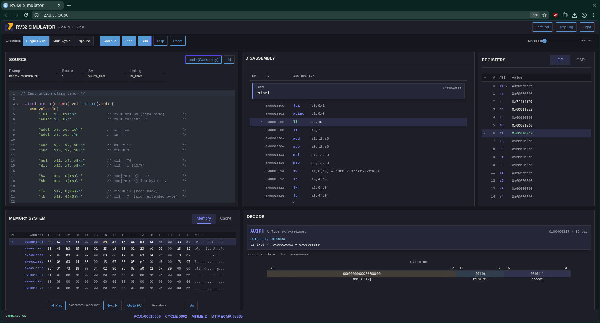

# RISC-V (RV32) Simulator

An educational simulator for 32-bit RISC-V programs. Write C or assembly in
the browser, then run it on a Single-Cycle, Multi-Cycle, or five-stage Pipeline
CPU and inspect what happens at each step.

<p align="center">
  
</p>

## Run it with Docker

Install [Docker](https://docs.docker.com/get-started/get-docker/), then choose
how you want to run the published image.

For a temporary container that Docker removes after it stops:

```bash
docker run --rm -p 8080:8080 atomc/rv32-simulator-atom:latest
```

To keep the container so you can restart it later:

```bash
docker run --name rv32-simulator -p 8080:8080 atomc/rv32-simulator-atom:latest
```

Restart the saved container with:

```bash
docker start -a rv32-simulator
```

Open <http://localhost:8080> and press `Ctrl+C` when you want to stop it.

The image already includes the simulator, GUI, example programs, Python, and
the RISC-V GNU toolchain. You do not need to clone or build the project. Other
published versions are listed on [Docker Hub](https://hub.docker.com/r/atomc/rv32-simulator-atom/tags).

## Features

- RV32I base instructions, the M and C extensions, and machine-mode Zicsr
  instructions.
- Single-Cycle, Multi-Cycle, and five-stage Pipeline execution.
- Pipeline forwarding, hazards, stalls, branch prediction, and flushes.
- Configurable instruction and data caches with FIFO or LRU replacement.
- Registers, CSRs, memory, cache state, disassembly, pipeline timing, traps,
  breakpoints, and terminal I/O in the GUI.
- Freestanding C and assembly programs compiled with the GNU RISC-V toolchain.
- A headless CLI and a small Python API.

This is a desktop interface. A browser window at least 1280 px wide is
recommended; mobile layouts are not supported.

## Using the GUI

1. Pick an example or paste a freestanding C/assembly program into the editor.
2. Select an ISA profile and linker mode.
3. Press **Compile**.
4. Choose **Single-Cycle**, **Multi-Cycle**, or **Pipeline**.
5. Use **Step** or **Run**, then inspect the CPU and memory panels.

Programs must provide `_start`; there is no C runtime or standard library. The
default build places code at `0x00010000`. Choose **With linker** when a program
uses the bundled section layout or symbols such as `__stack_top`.

| Mode | One Step does |
|---|---|
| Single-Cycle | Executes one complete instruction |
| Multi-Cycle | Advances one stage clock |
| Pipeline | Advances the whole pipeline by one clock |

| Action | Linux / Windows | macOS |
|---|---|---|
| Step | `Ctrl+Enter` | `Cmd+Enter` |
| Run / Stop | `Ctrl+Shift+Enter` | `Cmd+Shift+Enter` |
| Reset | `Ctrl+Alt+R` | `Cmd+Alt+R` |

## Run from source

Use this setup only if you want to develop the simulator or use the CLI/API.
You need:

- Python 3.12 or newer
- [`uv`](https://docs.astral.sh/uv/getting-started/installation/)
- A GNU RISC-V bare-metal toolchain with the `riscv64-unknown-elf-` prefix

On Ubuntu or Debian, install the toolchain with:

```bash
sudo apt update
sudo apt install gcc-riscv64-unknown-elf binutils-riscv64-unknown-elf
```

Then clone and start the GUI:

```bash
git clone https://github.com/AtomChidjai/RISC-V-SIM.git
cd RISC-V-SIM
uv sync
uv run rv32i-gui
```

The local server listens on <http://127.0.0.1:8080>. You can also start it with
`uv run gui/app.py`.

### CLI

Run a C or assembly file with the Single-Cycle engine:

```bash
uv run rv32i programs/examples/hello_terminal.c --trace --register
```

Useful options are `--trace`, `--register`, `--memory`, and `--max-cycles N`.
Run `uv run rv32i --help` for the complete command reference.

### Python API

```python
from rv32i import Simulator

sim = Simulator(trace=False, max_cycles=500)
sim.load("programs/examples/bubble_sort.c")
sim.run(delay=0)

print(sim.state())
print(sim.cache_stats())
```

`Simulator` is the package's public entry point. Use `step()`, `step_clk()`, or
`step_pipe()` to advance the Single-Cycle, Multi-Cycle, or Pipeline engine.

## Configuration

| Variable | Default | Purpose |
|---|---|---|
| `RV32I_GUI_HOST` | `127.0.0.1` | GUI bind address |
| `RV32I_GUI_PORT` | `8080` | GUI port |
| `PORT` | unset | Hosting-provider port when `RV32I_GUI_PORT` is unset |
| `RV32I_DEBUG` | unset | Set to `1` for instruction diagnostics |

Binding the source version to `0.0.0.0` exposes it to your network. The GUI has
no authentication, so only do this on a trusted network.

## Development

Install the development dependencies and run the checks:

```bash
uv sync --extra test --extra browser-test --extra lint
uv run pytest -q
uv run ruff check .
```

The browser test is opt-in:

```bash
RUN_BROWSER_TESTS=1 uv run pytest -q tests/test_gui_browser.py
```

The included [`render.yaml`](render.yaml) can also deploy the project as a
Docker service on Render.

## Scope

This project is an instruction-set and teaching-oriented timing simulator. It
is not RTL, a Linux system emulator, or a complete implementation of the
RISC-V privileged specification.

Released under the [MIT License](LICENSE). The vendored WaveDrom bundle keeps
its own [license notice](gui/assets/vendor/WAVEDROM_LICENSE). RISC-V names and
marks belong to RISC-V International; this project is independent and is not
endorsed by RISC-V International.
